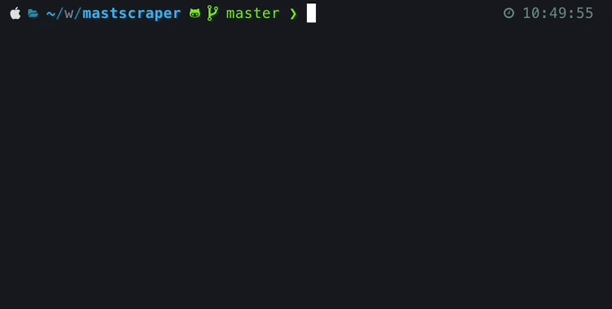

<div align="center">
  
</div>

<div align="center">
  
</div>

"mastscraper" is an open source command line tool that enables you to scrape the data off of https://mastedatabasen.dk. You are able to scrape the website both via its API and via the website directly. The two different scraping methods yields different results, as the API data contains some data that is not visible on the website, and the website contains some information that is not present via the API – the most important of which is the operator name :eyes:

**:warning: Scraping the data via the website directly might take a loooooong time**

## Usage

A picture says more than a thousand words, so here is a bunch of pictures in concatenation:

<div align="center">
  
</div>

Remember to install the damn thing before doing that :arrow_up:.

## Installation

```
npm i -g @westh/mastscraper
```

<a href="https://www.buymeacoffee.com/westh" target="_blank"></a>
